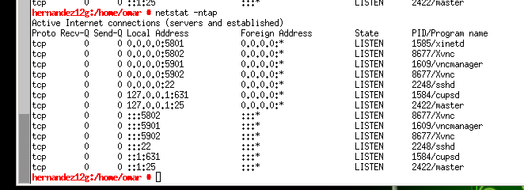

# Acceso Remoto con VNC

Conexiones remotas con **VNC**

Vamos a realizar las siguientes conexiones remotas **VNC**:

Accederemos a :

**- Windows 7 (server) - desde Windows 7 (cliente)**

**- Windows 7 (server) - desde GNU/Linux OpenSUSE (cliente)**

**- GNU/Linux OpenSUSE (server) - desde GNU/Linux OpenSUSE (cliente)**

**- GNU/Linux OpenSUSE (server) - desde Windows 7 (cliente)**

## 1.1 Acceso remoto en windows

Descargamos TightVNC. Esta es una herramienta libre disponible para Windows.

En el servidor VNC instalaremos **TightVNC server**

Ejecutamos ahora este comando **nmap -Pn IP-VNC-SERVER**, desde la máquina real GNU/Linux para comprobar que los servicios son visibles desde fuera de la máquina VNC-SERVER.

**Acceso desde la máquina cliente :**

En el cliente usaremos TightVNC viewer.

Tendremos acceso a la maquina server poniendo la ip del server

Ejecutamos el comando **netstat -n** como comprobación en el server:

## 1.2 Acceso remoto en OpenSUSE

Instalamos y configuramos **VNC** en Suse.

Ejecutamos **nmap -Pn IP-VNC-SERVER**, desde la máquina real GNU/Linux para comprobar que los servicios son visibles desde fuera de la máquina.

**vncviewer** es un cliente VNC que viene con OpenSUSE.

**vncviewer** *ip de nuestro cliente* (172.18.12.31) y entramos con acceso remoto al server.

Comprobamos con el comando **netstat -ntap** para verificar que se han establecido las conexiones remotas:

